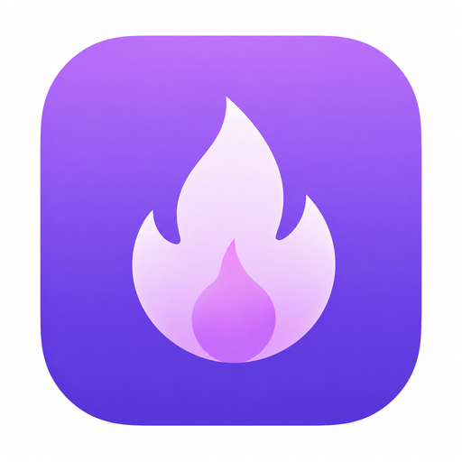
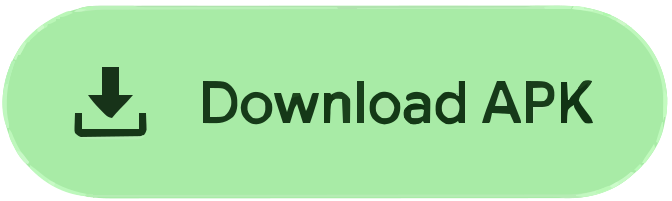
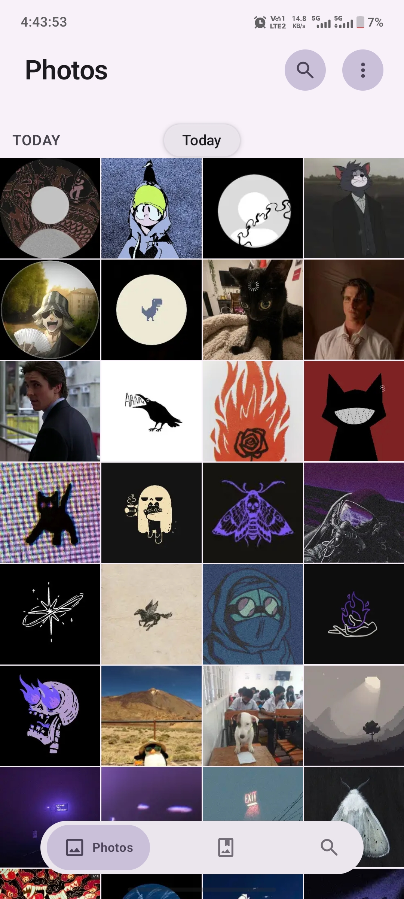
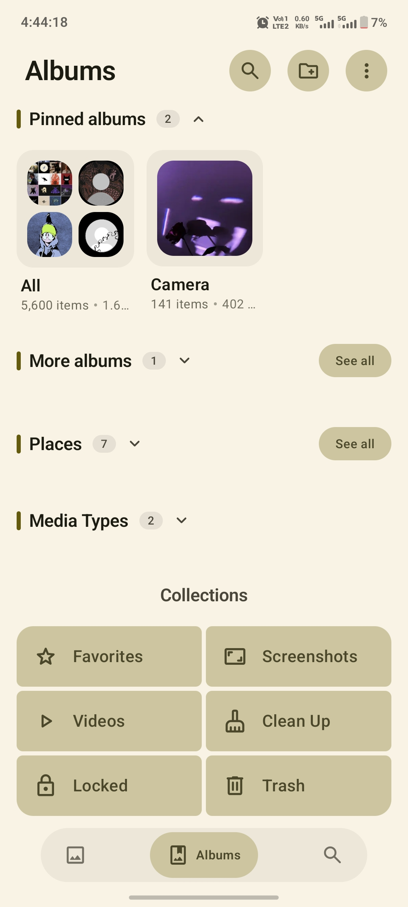
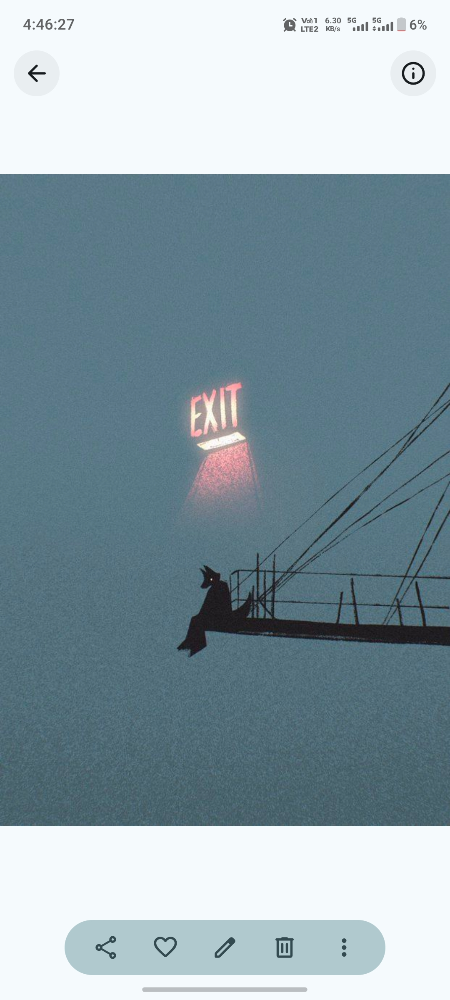
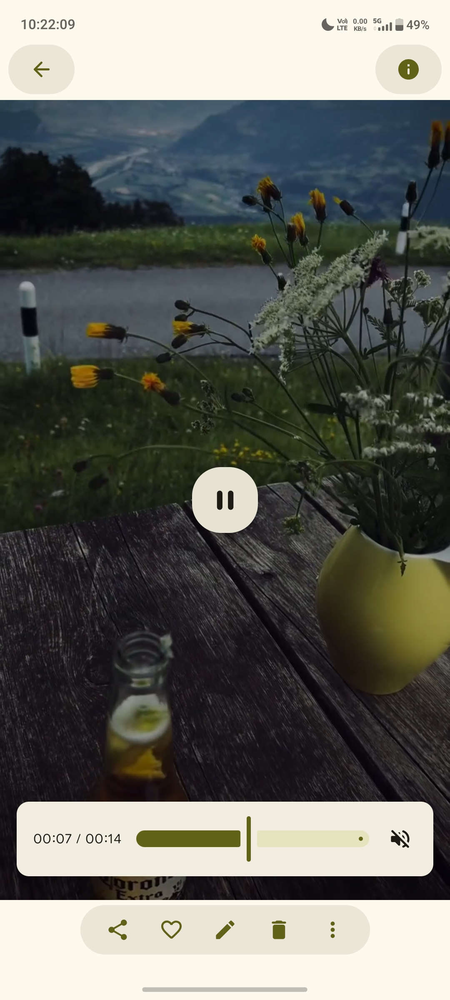
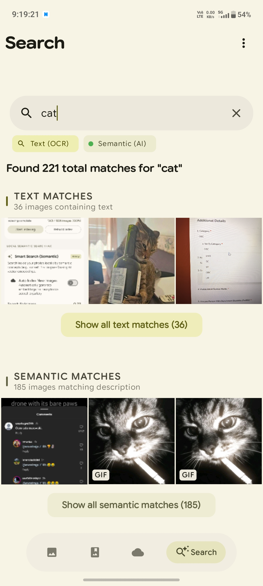
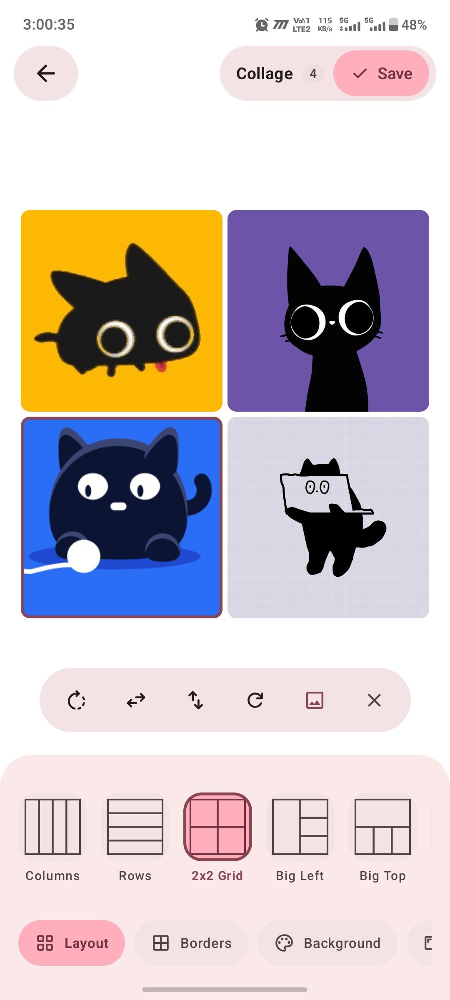
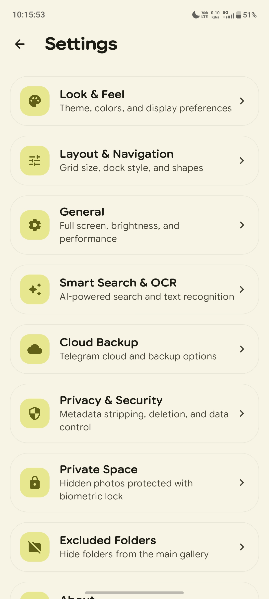

<div align="center">



# Photon Gallery

**An open-source, offline Android gallery designed around privacy, performance, and stunning visuals.**

<br/>

[](https://github.com/Bn5prS/Photon_Gallery/stargazers)
[](https://github.com/Bn5prS/Photon_Gallery/releases)
[](https://github.com/Bn5prS/Photon_Gallery)
[](https://developer.android.com/about/versions/12)
[](https://kotlinlang.org)
[](LICENSE)

<br/>

<a href="https://github.com/Bn5prS/Photon_Gallery/releases/latest">
  
</a>

<br/><br/>

> An open-source, offline Android gallery designed around privacy, performance, and stunning visuals.  
> Zero cloud. Zero tracking. Just your photos.

</div>

---

## ✨ Screenshots

| Home | Albums | Viewer | Video |
|:---:|:---:|:---:|:---:|
|  |  |  |  |

| Smart Search | Collage | Settings |
|:---:|:---:|:---:|
|  |  |  |

---

## 🚀 Features

- **Fluid Media Browsing** — Responsive grid with smooth animations, customizable column layouts, and instant loading.
- **Material 3 Expressive UI** — Shape-morphing animations, spring physics, variable typography, and Material You dynamic theming.
- **Full-Screen Viewer & Video Player** — Pinch-to-zoom, background blur, EXIF inspector, and advanced video controls.
- **On-Device Smart Search & OCR** — Natural-language semantic search and on-device text recognition running 100% locally.
- **Photo Map & Places** — Geotagged media exploration on an interactive offline-capable map.
- **Albums & Collections** — Smart auto-albums, custom pinning, folder exclusions, and custom album covers.
- **Photo Editor & Collage Builder** — Image cropping, rotation, filters, color adjustments, and multi-photo stitching.
- **Duplicate Cleaner & Recycle Bin** — Perceptual hash duplicate detection and soft-delete trash with auto-cleanup.
- **Private Space (Vault)** — Biometric-locked hidden vault isolated from the main gallery.

---

## 🛠️ Tech Stack

| Layer | Technology |
|---|---|
| **Language** | Kotlin 2.2, Coroutines, Flow |
| **UI** | Jetpack Compose, Material 3 Expressive, MaterialKolor, Material Symbols icons, Google Fonts (Outfit · Urbanist · Plus Jakarta Sans) |
| **Architecture** | MVVM, ViewModel, Room (SQLite + FTS5) |
| **Image Loading** | Coil 3 (GIF, WebP, HEIF, SVG, Video thumbnails) |
| **AI / ML** | ONNX Runtime (MobileCLIP), ML Kit (OCR) |
| **Navigation** | Compose Navigation with Shared Element Transitions |
| **Maps** | osmdroid (OpenStreetMap, offline-capable) |
| **Media** | Media3 / ExoPlayer |
| **Background** | WorkManager |
| **Min / Target SDK** | API 31 (Android 12) / API 37 |

---

## ⚡ Getting Started

### Prerequisites
- Android Studio Meerkat or newer
- JDK 11+
- Android SDK with API 37

### Build & Deploy

```bash
# 1. Clone the repo
git clone https://github.com/Bn5prS/Photon_Gallery.git
cd Photon_Gallery

# 2. Verify the build compiles
./gradlew compileDebugKotlin

# 3. Assemble a signed release APK
./gradlew assembleRelease

# 4. Install on connected device
adb install -r app/build/outputs/apk/release/app-release.apk
```

> **Note:** A signing config is required for release builds. See Android's [signing documentation](https://developer.android.com/studio/publish/app-signing) to set one up.

---

## 🤝 Contributing

Contributions are welcome! To contribute:

1. **Fork** the repository
2. **Create a branch**: `git checkout -b feature/your-feature`
3. **Commit your changes**: `git commit -m "feat: add your feature"`
4. **Push**: `git push origin feature/your-feature`
5. **Open a Pull Request**

Please follow [Conventional Commits](https://www.conventionalcommits.org/) for commit messages.

---

## 📄 License

This project is licensed under a **Proprietary Source-Available License** — you may view and study the code, but redistribution and commercial use are prohibited. See the [LICENSE](LICENSE) file for full terms.

---

<div align="center">

Built with Kotlin & Jetpack Compose

[](https://github.com/Bn5prS/Photon_Gallery)

</div>
